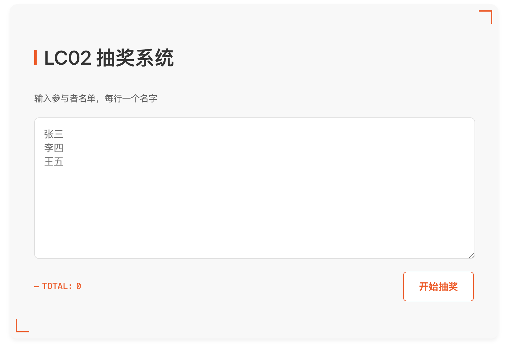

# LC02 抽奖系统

一个简单而美观的在线抽奖系统，使用 Go 语言后端和纯前端 HTML/CSS/JavaScript 构建。



## 功能特点

- 🎯 公平随机抽奖
- 🎨 现代简约的界面设计
- 📱 完全响应式，支持移动端
- ⚡️ 快速且轻量级
- 🔍 重复名称检测
- ✨ 优雅的动画效果

## 随机性说明

本系统使用了密码学安全的随机数生成方法，确保抽奖结果的公平性：

- 使用 Go 标准库 `crypto/rand` 生成随机数
  - 在 Unix-like 系统（Linux/macOS）中使用 `/dev/urandom` 设备
  - 在 Windows 系统中使用 `CryptoAPI`
  - 这些随机源都依赖硬件噪声、系统事件等熵源
  - 生成的随机数在统计学上无法预测和重现
  - 即使攻击者获得大量历史数据，也无法预测下一个随机数
- 每次抽奖使用新的随机源，避免可预测性
- 不依赖伪随机数生成器（如 math/rand），杜绝随机数周期性问题

### 概率分布测试

进行 10 万次抽奖测试，结果显示各参与者的中奖概率非常接近理论值：

```
$ go test -v
期望每人抽中次数: 12500 (12.5%)
实际抽奖结果:
周九: 12553 次 (12.55%)
吴十: 12492 次 (12.49%)
张三: 12545 次 (12.54%)
李四: 12537 次 (12.54%)
王五: 12385 次 (12.38%)
赵六: 12528 次 (12.53%)
钱七: 12524 次 (12.52%)
孙八: 12436 次 (12.44%)
```

可以看到：
- 所有参与者的实际中奖概率都在 12.38% ~ 12.55% 之间
- 与理论概率 12.5% 的偏差不超过 0.12%
- 证实了系统具有极高的随机公平性

这种实现方式保证了：
- 无法通过历史数据预测下一个中奖者
- 每个参与者都有完全相等的中奖概率
- 不受系统时间或其他外部因素影响
- 基于硬件级别的熵源，具有真随机性
- 符合密码学安全标准

## 快速开始

### 前置要求

- 确保有可用的 Go 环境
- 确保有可用的浏览器

### 运行

只需执行以下命令：

```bash
$ go run main.go
2024/11/27 20:57:40 服务启动在 http://localhost:8080
2024/11/27 20:57:40 正在尝试打开浏览器...
2024/11/27 20:57:40 如果浏览器没有自动打开，请手动访问上述链接
2024/11/27 20:57:41 浏览器已打开
```

程序启动后会：
1. 自动在本地启动 Web 服务器
2. 自动打开系统默认浏览器并进入抽奖页面
3. 如果浏览器没有自动打开，可以手动访问控制台显示的链接

> 注：自动打开浏览器功能支持 Windows、macOS 和 Linux 系统

